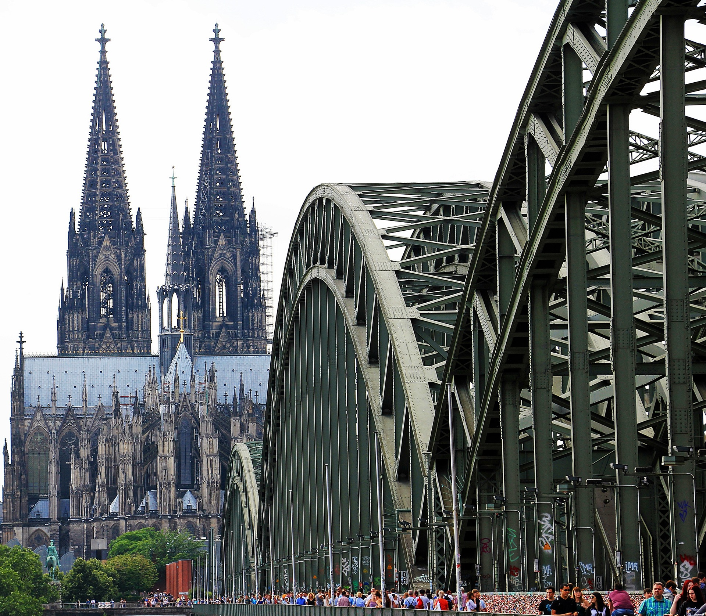

.. include:: global.rst

==============
Infrastructure
==============

******************
Google Cloud (GCP)
******************

*************************
Amazon Web Services (AWS)
*************************

One of the very first things you should do (after creating an account, 
that is) is to configure mutli-factor authentication [#]_ (MFA).

.. [#] MFA: https://docs.aws.amazon.com/IAM/latest/UserGuide/id_credentials_mfa.html

.. index::
   single: multi-factor authentication

*************
Digital Ocean
*************

One of my favorite things about this provider is their collection of tutorials
that they maintain. You can pick up lots of tips and tricks sbout the topics 
in this book by going through their site.

.. raw:: latex

    \clearpage

*******************
Directory Structure
*******************

Relevant folders and files related to our build pipeline are shown below. The
users home directory and `workspace` subdirectory is implied and removed 
from the diagram for clarity.

.. graphviz::
   :caption: GitHub Actions
   :align: center

   digraph folders {
      "cloudlab" [shape=folder];
      "gcp" [shape=folder];
      "aws" [shape=folder];
      "digital_ocean" [shape=folder];
      "cloudlab" -> "aws";
      "cloudlab" -> "digital_ocean";
      "cloudlab" -> "gcp";
   }